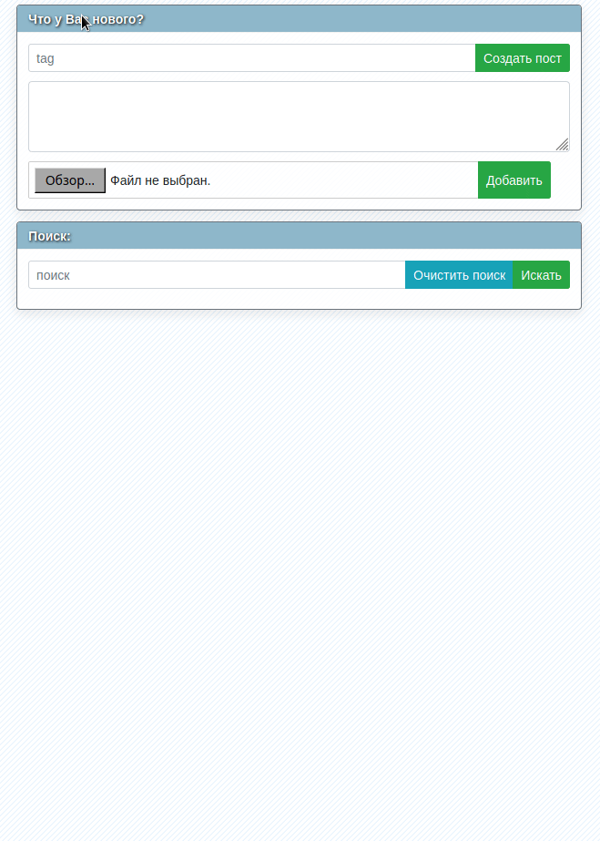

# svelte-feed

Simple fullstack app for facebook-like feed. For selfhosting and selfposting.


### description

A simple application for posting notes and links. Created for those cases when you do not want to publish important and personal information in public services.

Used tools:

[Svelte](https://svelte.dev/) - reactive JS framework.

[MongoDB](https://www.mongodb.com) - nosql database.

[linkpreview](linkpreview.net) - API for getting sites previews without CORS issues.

### requirements

1. First of all you need API KEY for getting sites preview. Go [here](https://my.linkpreview.net/auth/new) and register. Put a key to [env.js](frontend/src/env.js).
2. Install [docker-compose](https://docs.docker.com/compose/install/).

### usage

1. Run docker-compose

```
docker-compose up -d
```
2. Open [http://localhost:80](http://localhost:80)
